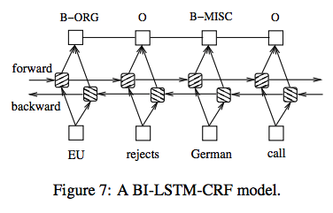
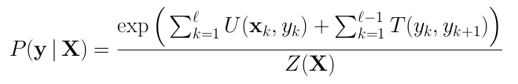

# Named Entity Relation
In this notebook I train/implement a NER model using Conditional Random fields in pytorch. The CRF layer is compeletely self implemented using forward algorithm and to decode the viterbi decoding is applied using back pointers, also self implemented. The model is as given in this [paper](https://arxiv.org/pdf/1603.01360.pdf)

# Dataset
 I use the NER data set available on [Kaggle](https://www.kaggle.com/abhinavwalia95/entity-annotated-corpus). This is basically just a map between each word in a sentence to a tag.<br />
You can find out about the tagging scheme [here](https://en.wikipedia.org/wiki/Inside%E2%80%93outside%E2%80%93beginning_(tagging))


# Pre-processing
 Firstly I extract all sentences in the format
 ```
 word-->tag
 ```
 Now extract all the unique words and tags and give them a unique index. Then store maps word2index , tag2index and vice-versa. Three new tags are introduced...
 ```
 <PAD> , <BOS> and <EOT>
 ```
 
 # Model
 The model used here is a CRF layer on top of a Bi-LSTM. <br />
 ```
 Word_sequence->Index->Embedding->Bi-LSTM-->CRF_layer
 ```
 <br /> <br />
 
 
 The Bi-LSTM looks like... <br /> <br />
 
 <br />
 The output of Bi_LSTM has the shape ```sequence_length*n_tags```
  <br /> <br />
 These are just scores for each tag at each time step. I said score and not probablities. This is because we do not apply softmax layer at the end for the outputs.
 ### Do not use softmax 
 You can check the reason [here](https://stackoverflow.com/questions/58377983/which-actvation-function-to-use-for-linear-chain-crf-classifier). I have tried putting a softmax layer at the end of the Bi-lstm outputs and it actually gives terrible results !!!

 ### The CRF layer
 The CRF layer basically trains a matrix of shape ```n_tags*n_tags```. This matrix represents the transition probablity of going from i'th tag to j'th tag.
 
 ### The loss function
 The objective is to maximize the probablity of the path that leads to the correct answer and to minimize the others.
 
 
 
 Where the numerator represents the probablity for the desired path , while Z is the normalizing value(The sum of probablities of all the paths)
 
 
